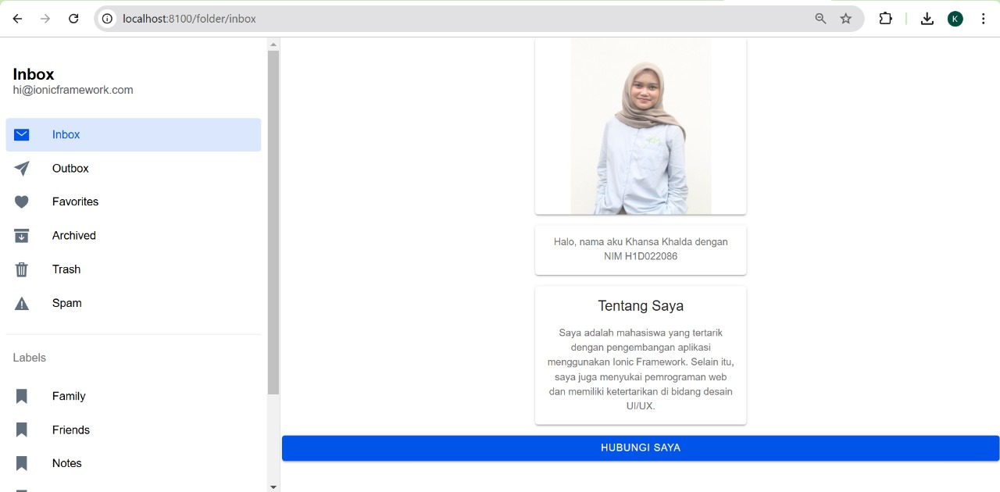

# Ionic Profile App

Aplikasi ini merupakan contoh aplikasi profil sederhana menggunakan Ionic Framework.

## Screenshot Hasil

## Cara Menambahkan Komponen di Halaman Ionic

Untuk menambahkan komponen di halaman Ionic, Anda bisa mengikuti langkah-langkah berikut:

1. **Tambahkan Codingan di folder.page.html**:

**<ion-content class="content-center">
  <!-- Card untuk Foto -->
  <ion-card class="center-card">
    <ion-img src="assets/fotokhansa.jpg" style="width: 200px; height: auto;"></ion-img>
  </ion-card>

  <!-- Card untuk Penjelasan -->
  <ion-card class="center-card">
    <ion-card-content>
      
Halo, nama aku Khansa Khalda dengan NIM H1D022086

    </ion-card-content>
  </ion-card>

  <!-- Komponen Tambahan -->
  <ion-card class="center-card">
    <ion-card-header>
      <ion-card-title>Tentang Saya</ion-card-title>
    </ion-card-header>
    <ion-card-content>
      
Saya adalah mahasiswa yang tertarik dengan pengembangan aplikasi menggunakan Ionic Framework. Selain itu, saya juga menyukai pemrograman web dan memiliki ketertarikan di bidang desain UI/UX.

    </ion-card-content>
  </ion-card>

  <!-- Tombol Hubungi Saya -->
  <ion-button expand="block" color="primary" style="margin-top: 16px;">
    Hubungi Saya
  </ion-button>
</ion-content>**

2. **Tambahkan Gambar fotokhansa.jpg ke Folder assets**:

- Tempatkan file gambar fotokhansa.jpg di dalam folder src/assets.

- Pastikan path gambar di dalam file HTML sesuai, yaitu src="assets/fotokhansa.jpg".

3. **Tambahkan CSS ke folder.page.scss**:

:host {
  display: flex;
  justify-content: center;
}

.content-center {
  display: flex;
  flex-direction: column;
  align-items: center;
  justify-content: center;
  min-height: 100vh;
  padding: 20px;
  text-align: center;
}

.center-card {
  display: flex;
  flex-direction: column;
  align-items: center;
  width: 100%;
  max-width: 300px;
  margin: 0 auto 16px auto;
  text-align: center;
}

ion-content {
  --padding-start: 0;
  --padding-end: 0;
}

4. **Jalankan Aplikasi**: ionic serve
